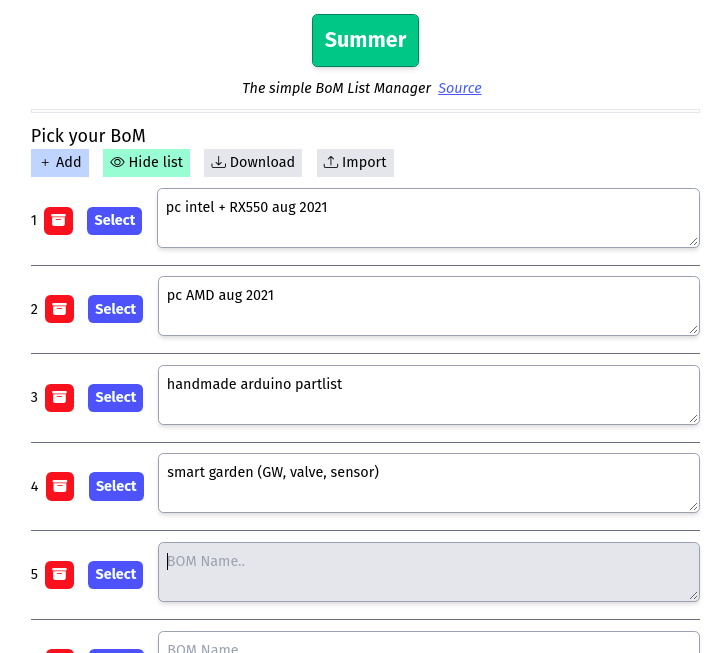

# Summer2

BOM List manager for summing up your project budget. 2nd version of [Summer](https://github.com/vmasdani/summer).  

Why a new repository? Because the storage system is totally different--the former uses native IndexedDB while this one uses only key-value store--and the two is not interoperable.

- Summer uses native CSS, [Elm](https://elm-lang.org/), and native IndexedDB (which is really hard to maintain for this simple use-case)
- Summer2 uses [TailwindCSS](https://tailwindcss.com/), [Elm](https://elm-lang.org/), and [idb-keyval](https://github.com/jakearchibald/idb-keyval)



I plan to add:
- JSON import <-> export and interoperability with Summer v1
- Different currencies
- Online storage/synchronization
- BoM duplication for similar BoM list
- Link for online shopping reference

### Running
1. Install `npm i`
2. Build Tailwind first
```sh
./run.py build-tailwind
```
3. Run `./run.py dev` for development

Will be available in `http://localhost:5000`    